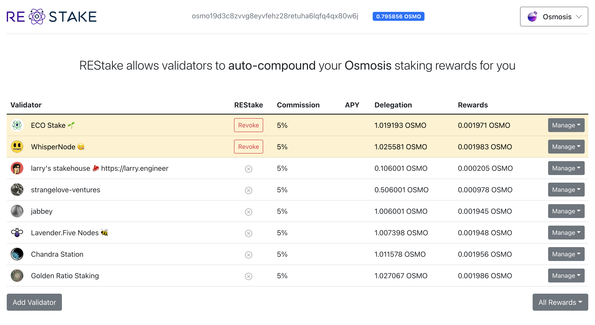

# [REStake](https://restake.app)

REStake allows delegators to grant permission for a validator to compound their rewards, and provides a script validators can run to find their granted delegators and send the compounding transactions automatically.

REStake is also a convenient staking tool, allowing you to claim and compound your rewards individually or in bulk. This can save transaction fees and time, and many more features are planned.

[](https://restake.app)

Try it out at [restake.app](https://restake.app).

## How it works / Authz

Authz is a new feature for Tendermint chains which lets you grant permission to another wallet to carry out certain transactions for you. These transactions are sent by the grantee on behalf of the granter, meaning the validator will send and pay for the TX, but actions will affect your wallet (such as claiming rewards).

REStake specifically lets you grant a validator permission to send `WithdrawDelegatorReward` and `Delegate` transactions for their validator only (note `WithdrawDelegatorReward` is technically not restricted to a single validator). The validator cannot send any other transaction types, and has no other access to your wallet. You authorize this using Keplr as normal.

A script is also provided which allows a validator to automatically search their delegators, check each for the required grants, and if applicable carry out the claim and delegate transactions on their behalf in a single transaction. This script should be run daily, and the time you will run it can be specified when you [add your operator](#become-an-operator).

## Limitations

- As of writing, Ledger is unable to send the necessary transactions to enable Authz. This is purely due to the way transactions are sent to a Ledger device and a workaround should be possible soon.
- Authz is also not fully supported yet. Many chains are yet to update. The REStake UI will fall back to being a manual staking app with useful manual compounding features.
- Currently REStake needs the browser extension version of Keplr, but WalletConnect and Keplr iOS functionality will be added ASAP.

## Become an operator

Becoming an operator is extremely easy. You need to do three things:

### Setup a bot wallet

Generate a new hot wallet you will use to automatically carry out the staking transactions. The mnemonic will need to be provided to the script so **use a dedicated wallet and only keep enough funds for transaction fees**. The ONLY menmonic required here is for the hot wallet, do not put your validator operator mnemonic anywhere.

You only need a single mnemonic for multiple Cosmos chains, and the script will check each network in the [networks.json](./src/networks.json) file for a matching bot address.

#### Derivation Paths (IMPORTANT)

Right now, the REStake autostaking script uses the standard 118 derivation path by default. Some networks prefer a different path and apps like Keplr will honour this. **The address the autostake script uses might not match Keplr**.

As there are existing operators using the 118 path, operators will need to opt in to the correct path when they want to upgrade. **New operators should use the correct path before they get grants**.

The correct path can be set in one of two ways using a [config override](#overriding-networks-config-locallyuse-your-own-node) file. You should use `"correctSlip44": true` if possible.

```jsonc
{
  "desmos": {
    "prettyName": "Desmos 852",
    "autostake": {
      "correctSlip44": true, // Use the correct slip44 path from chain-registry
      "slip44": 852 // Alternatively set a specific slip44 path
    }
  }
}
```

In the future, `correctSlip44` will become the default and you will need to set `slip44` explicitely if you want to use the 118 path.

### Setup the autostaking script and run daily

You can run the autostaking script using `docker-compose` or using `npm` directly. In both cases you will need to provide your mnemonic in a `MNEMONIC` environment variable.

Instructions are provided for Docker Compose and will be expanded later.

### Install Docker and Docker Compose

Best bet is to follow the Docker official guides. Install Docker first, then Docker Compose.

Docker: [docs.docker.com/get-docker](https://docs.docker.com/get-docker/)

Docker Compose: [docs.docker.com/compose/install](https://docs.docker.com/compose/install/)

### Clone the repository and setup .env

Clone the repository and copy the sample `.env` file ready for your mnemonic.

```bash
git clone https://github.com/eco-stake/restake
cd restake
cp .env.sample .env
```

**Populate your new .env file with your mnemonic.**

### Running the script manually

Running the autostake script manually is then simple.

Note you might need `sudo` depending on your docker install.

```bash
docker-compose run --rm app npm run autostake
```

Pass a network name to run the script for a single network at a time.

```bash
docker-compose run --rm app npm run autostake osmosis
```

### Updating your local version

REStake is MVP. Very MVP. Updates are happening all the time and there are bugs that still need fixing. Make sure you update often.

Update your local repository and pre-build your Docker containers with the following commands:

```bash
git pull
docker-compose build --no-cache
```

### Setting up Cron to make sure the script runs daily

You should setup your script to run at the same time each day.
2 methods are described below; using `crontab` or using `systemd-timer`.

In both cases, ensure your system time is correct and you know what time the script will run in UTC, as that will be required later. Both examples below are for 21:00.

Don't forget to [update often](#updating-your-local-version)!

#### Using `crontab`

```bash
crontab -e

0 21 * * * /bin/bash -c "cd restake && docker-compose run --rm app npm run autostake" > ./restake.log 2>&1
```

#### Using `systemd-timer`

Systemd-timer allow to run a one-off service with specified rules.

##### Create a systemd unit file

The unit file describe the application to run.  We define a dependency with the timer with the `Wants` statement.

```bash
sudo vim /etc/systemd/system/restake.service
```

```bash
[Unit]
Description=stakebot service with docker compose
Requires=docker.service
After=docker.service
Wants=restake.timer

[Service]
Type=oneshot
WorkingDirectory=/path/to/restake
ExecStart=/usr/bin/docker-compose run --rm app npm run autostake

[Install]
WantedBy=multi-user.target
```

##### Create a systemd timer file

The timer file defines the rules for running the restake service every day. All rules are described in the [systemd documentation](https://www.freedesktop.org/software/systemd/man/systemd.timer.html).

```bash
sudo vim /etc/systemd/system/restake.timer
```

```bash
[Unit]
Description=Restake bot timer

[Timer]
AccuracySec=1min
OnCalendar=*-*-* 21:00:00

[Install]
WantedBy=timers.target
```

##### Enable and start everything

```bash
systemctl enable restake.service
systemctl enable restake.timer
systemctl start restake.timer
```

##### Check your timer

`$ systemctl status restake.timer`
<pre><font color="#8AE234"><b>●</b></font> restake.timer - Restake bot timer
     Loaded: loaded (/etc/systemd/system/restake.timer; enabled; vendor preset: enabled)
     Active: <font color="#8AE234"><b>active (waiting)</b></font> since Sun 2022-03-06 22:29:48 UTC; 2 days ago
    Trigger: Wed 2022-03-09 21:00:00 UTC; 7h left
   Triggers: ● restake.service
</pre>
`$ systemctl status restake.service`
<pre>● restake.service - stakebot service with docker compose
     Loaded: loaded (/etc/systemd/system/restake.service; enabled; vendor preset: enabled)
     Active: inactive (dead) since Tue 2022-03-08 21:00:22 UTC; 16h ago
TriggeredBy: <font color="#8AE234"><b>●</b></font> restake.timer
    Process: 86925 ExecStart=/usr/bin/docker-compose run --rm app npm run autostake (code=exited, status=0/SUCCESS)
   Main PID: 86925 (code=exited, status=0/SUCCESS)
</pre>

### Overriding networks config locally/use your own node

You will likely want to customise your networks config, e.g. to set your own node URLs to ensure your autocompounding script completes successfully.

Create a `src/networks.local.json` file and specify the networks you want to override. The below is just an example, **you should only override a config if you need to**.

```json
{
  "osmosis": {
    "prettyName": "Osmosis with Fees",
    "restUrl": [
      "https://rest.validator.com/osmosis"
    ],
    "rpcUrl": [
      "https://rpc.validator.com/osmosis"
    ],
    "gasPrice": "0.001uosmo",
    "autostake": {
      "batchTxs": 69,
      "batchQueries": 50,
      "delegatorTimeout": 5000
    }
  },
  "desmos": {
    "prettyName": "Desmos 118",
    "autostake": {
      "correctSlip44": true
    }
  },
  "cosmoshub": {
    "enabled": false
  }
}
```

Any values you specify will override the `networks.json` file. These are examples, you can override as much or little as you need.

Arrays will be replaced and not merged. The file is `.gitignore`'d so it won't affect upstream updates.

Note that REStake requires a node with indexing enabled and minimum gas prices matching the networks.json gas price (or your local override).

## Submiting your operator

### Setup your REStake operator

You now need to update the [networks.json](./src/networks.json) file at `./src/networks.json` to add your operator to any networks you want to auto-compound for. Check the existing file for examples, but the operators array is simple:

```json
"operators": [{
  "address": "osmovaloper1u5v0m74mql5nzfx2yh43s2tke4mvzghr6m2n5t",
  "botAddress": "osmo1yxsmtnxdt6gxnaqrg0j0nudg7et2gqczed559y",
  "runTime": ["09:00", "21:00"],
  "minimumReward": 1000
},
```

`address` is your validator's address, and `botAddress` is the address from your new hot wallet you generated earlier.

`runTime` is the time *in UTC* that you intend to run your bot, and there are a few options. Pass a single time, e.g. `09:00` to specify a single run at 9am UTC. Use an array for multiple specified times, e.g. `["09:00", "21:00"]`. Use an interval string for multiple times per hour/day, e.g. `"every 15 minutes"`.

`minimumReward` is the minimum reward to trigger autostaking, otherwise the address be skipped. This could be set higher for more frequent restaking. Note this is in the base denomination, e.g. `uosmo`.

Repeat this config for all networks you want to REStake for.

Note that the `botAddress` is the address which will be granted by the delegator in the UI to carry out their restaking transactions.

#### Submit your operator

You can now submit your `networks.json` update to the repository in a pull request which will be merged and deployed as soon as possible.

## Adding/updating a network

Network information is sourced from the [Chain Registry](https://github.com/cosmos/chain-registry) via the [registry.cosmos.directory](https://registry.cosmos.directory) API. The `networks.json` defines which chains appear in REStake; so long as the chain name matches the directory name from the Chain Registry, all chain information will be sourced automatically.

To add a network to REStake, add the required information to `networks.json` as follows:

```json
{
  "name": "osmosis",
  "restUrl": [
    "https://rest.cosmos.directory/osmosis",
  ],
  "rpcUrl": [
    "https://rpc.cosmos.directory/osmosis",
  ],
  "gasPrice": "0.025uosmo",
  "testAddress": "osmo1yxsmtnxdt6gxnaqrg0j0nudg7et2gqczed559y",
  "ownerAddress": "osmovaloper1u5v0m74mql5nzfx2yh43s2tke4mvzghr6m2n5t",
  "operators": [
  ],
  "authzSupport": true
}
```

Note that most attributes from Chain Registry can be overriden by defining the camelCase version in networks.json.

## Running the UI

Run the UI using docker with one line:

```bash
docker run -p 80:80 -t ghcr.io/eco-stake/restake
```

Alternative run from source using `docker-compose up` or `npm start`.

## Ethos

The REStake UI is both validator and network agnostic. Any validator can be added as an operator and run this tool to provide an auto-compounding service to their delegators, but they can also run their own UI if they choose and adjust the branding to suit themselves.

For this to work, we need a common source of chain information, and a common source of 'operator' information. Chain information is sourced from the [Chain Registry](https://github.com/cosmos/chain-registry), via an API provided by [cosmos.directory](https://registry.cosmos.directory). Operator information currently lives in the [networks.json](./src/networks.json) file in this repository.

If you fork this repository to provide your own UI, please keep up to date with the upstream to ensure you have the latest [networks.json](./src/networks.json) to include all operators. Some honesty is needed until we have a more decentralised solution.

## Disclaimer

The initial version of REStake was built quickly to take advantage of the new authz features. I'm personally not a React or Javascript developer, and this project leans extremely heavily on the [CosmJS project](https://github.com/cosmos/cosmjs) and other fantastic codebases like [Keplr Wallet](https://github.com/chainapsis/keplr-wallet) and [Osmosis Zone frontend](https://github.com/osmosis-labs/osmosis-frontend). It functions very well and any attack surface is very limited however. Any contributions, suggestions and ideas from the community are extremely welcome.

## ECO Stake 🌱

ECO Stake is a climate positive validator, but we care about the Cosmos ecosystem too. We built REStake to make it easy for all validators to run an autocompounder with Authz, and it's one of many projects we work on in the ecosystem. [Delegate with us](https://ecostake.com) to support more projects like this.
